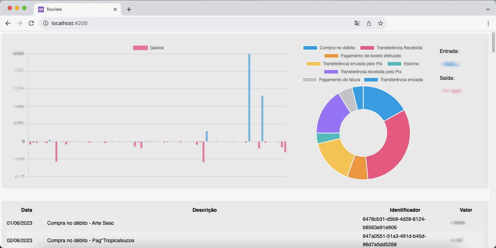

# Nuview

O Nuview é uma aplicação Angular que permite a visualização e análise do extrato financeiro gerado pelo Nubank. Com o Nuview, você pode carregar um arquivo CSV contendo informações do seu extrato e obter insights visuais através de gráficos.

## Instruções de Uso

Execute `ng serve` para iniciar um servidor de desenvolvimento. Acesse http://localhost:4200/. O aplicativo será recarregado automaticamente se você alterar qualquer um dos arquivos de origem.

## Licença

Este projeto está licenciado sob a Licença MIT - consulte o arquivo [LICENSE](./LICENSE) para obter detalhes.
